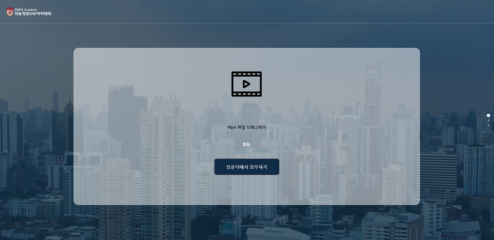

# TOC with CCTV
고려대학교 지능정보 SW아카데미 2기 최종 성과발표회 🥇대상작(정보통신기획평가원장상)

## About project
TOC(Tracking Object with Caption in CCTV)는 텍스트 키워드를 통해 CCTV 영상 속 특정 인상착의의 사람을 찾아주는 시큐리티 서비스입니다. 성별, 연령대, 착용한 옷의 특징 및 액세서리(가방 등)에 대한 정보를 키워드로 입력하면, 해당 인물이 등장한 시간대를 돌려줍니다.
이를 위해 이미지 캡션 모델 BLIP(Bootstrapping Language-Image Pre-training for Unified Vision-Language Understanding and Generation)을 fine-tuning하고, 사람 객체 추적에 yolo-deepsort 라이브러리를 사용했습니다.

TOC(Tracking Object with Caption in CCTV) is a security web service that finds people in CCTV footage through text keywords.
To do this, We finetuned image captioning model BLIP(Bootstrapping Language-Image Pre-training for Unified Vision-Language Understanding and Generation) and used YoloDeepsort for Tracking human object.

 
출발점 및 방향성

 
 ### 문제 발견
   - CCTV 영상을 통해 실종자, 범죄 용의자에 대한 단서를 찾기 위해서는 영상자료를 전부 살펴보아야함
   - 방대한 녹화 영상을 사람이 하나하나 살펴보는 방식의 대응은 많은 시간 비용이 들어 비효율적  
 
 ### 문제 정의 및 솔루션
 - 영상 속 인물의 시각적 단서(인상착의 등)을 텍스트로 변환하여, 기존의 텍스트 검색을 적용하여 원하는 인물을 빠르게 찾고자 하는 문제로 재정의
 - 그러나 dense video captioning 및 dense image captiong의 현실적 성능과 컴퓨팅 리소스의 문제 발생
 - 인물 추적을 위한 yolo-deepsort 라이브러리와, 추적된 인물에 대한 image captioning을 수행하는 BLIP 모델을 결합하여 서비스 구축

## Data
image captiong 모델인 BLIP의 fine-tuning에 사용된 데이터셋은 [유동 인구 분석을 위한 CCTV 영상 데이터](https://www.aihub.or.kr/aihubdata/data/view.do?currMenu=115&topMenu=100&aihubDataSe=realm&dataSetSn=489)에 구축된 주석 정보를 활용해 영상에 등장한 인물 사진을 cropping하였습니다. 또한 주석 데이터에 존재하는 외양정보를 조합하여 해당 인물 사진에 해당하는 캡션을 생성하였습니다. 이후 수작업으로 노이즈가 없는 사진-캡션쌍 5천 개를 확보한 후, image augmentation 기법과 gpt API를 활용한 문장 paraphrasing으로 데이터를 증강하여 총 25,000개의 fine-tuning을 위한 인물 사진-캡션 쌍 데이터를 확보하였습니다.

## Achitecture

## Result

## Demo website of Tracking with Caption
#### * Main page for video input

#### * Page to enter keywords indicating the person you want to find

#### * Convert video

#### * Result page

## Reference
* [1] T. Wang, R. Zhang, Z. Lu, F. Zheng, R. Cheng, and P. Luo, “End-to-End Dense Video Captioning with Parallel Decoding,” in 2021 IEEE/CVF International Conference on Computer Vision (ICCV), Montreal, QC, Canada: IEEE, Oct. 2021, pp. 6827–6837. doi: 10.1109/ICCV48922.2021.00677.
* [2] Jianfeng Wang, Zhengyuan Yang, Xiaowei Hu, Linjie Li, Kevin Lin, Zhe Gan, Zicheng Liu, CeLiu, and Lijuan Wang. Git: A generative image-to-text transformer for vision and language. arXiv preprint arXiv:2205.14100, 2022.
* [3] MMTracking : https://github.com/open-mmlab/mmtracking
* [4] Yolov4deepsort : https://github.com/theAIGuysCode/yolov4-deepsort

